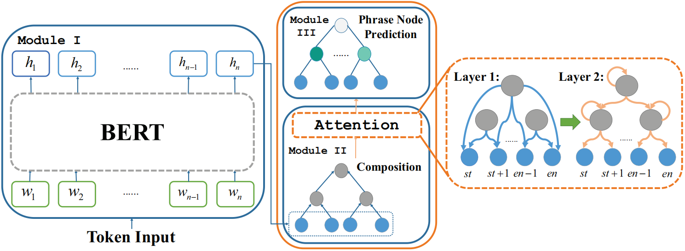

# SentiBERT
Code for *SentiBERT: A Transferable Transformer-Based Architecture for Compositional Sentiment Semantics* (ACL'2020).
https://arxiv.org/abs/2005.04114

## Model Architecture
<p align="center">
    
</p> 

## Requirements
### Environment
```
* Python == 3.6.10
* Pytorch == 1.1.0
* CUDA == 9.0.176
* NVIDIA GeForce GTX 1080 Ti
* HuggingFaces Pytorch (also known as pytorch-pretrained-bert & transformers)
* Stanford CoreNLP (stanford-corenlp-full-2018-10-05)
* Numpy, Pickle, Tqdm, Scipy, etc. (See requirements.txt)
```

### Datasets
Datasets include:
```
* SST-phrase
* SST-5 (almost the same with SST-phrase)
* SST-3 (almost the same with SST-phrase)
* SST-2
* Twitter Sentiment Analysis (SemEval 2017 Task 4)
* EmoContext (SemEval 2019 Task 3)
* EmoInt (Joy, Fear, Sad, Anger) (SemEval 2018 Task 1c)
```
*Note that there are no individual datasets for SST-5. When evaluating SST-phrase, the results for SST-5 should also appear.* 

### File Architecture (Selected important files)
```
-- /examples/run_classifier_new.py                                  ---> start to train
-- /examples/run_classifier_dataset_utils_new.py                    ---> input preprocessed files to SentiBERT
-- /pytorch-pretrained-bert/modeling_new.py                         ---> detailed model architecture
-- /examples/lm_finetuning/pregenerate_training_data_sstphrase.py   ---> generate pretrained epochs
-- /examples/lm_finetuning/finetune_on_pregenerated_sstphrase.py    ---> pretrain on generated epochs
-- /preprocessing/xxx_st.py                                         ---> preprocess raw text and constituency tree
-- /datasets                                                        ---> datasets
-- /transformers (under construction)                               ---> RoBERTa part
```

## Get Started
### Preparing Environment
```
conda create -n sentibert python=3.6.10
conda activate sentibert

conda install pytorch==1.1.0 torchvision==0.3.0 cudatoolkit=9.0 -c pytorch

cd SentiBERT/

wget http://nlp.stanford.edu/software/stanford-corenlp-full-2018-10-05.zip
unzip stanford-corenlp-full-2018-10-05.zip

export PYTHONPATH=$PYTHONPATH:XX/SentiBERT/pytorch_pretrained_bert
export PYTHONPATH=$PYTHONPATH:XX/SentiBERT/
export PYTHONPATH=$PYTHONPATH:XX/
```
### Preprocessing
1. Split the raw text and golden labels of sentiment/emotion datasets into `xxx_train\dev\test.txt` and `xxx_train\dev\test_label.npy`, assuming that `xxx` represents task name.
2. Obtain tree information. There are totally three situtations.
* For tasks **except SST-phrase**, **SST-2,3,5**, put the files into `xxx_train\test.txt` files into `/stanford-corenlp-full-2018-10-05/`. To get binary sentiment constituency trees, please run
```
cd /stanford-corenlp-full-2018-10-05
java -cp "*" edu.stanford.nlp.pipeline.StanfordCoreNLP -annotators tokenize,ssplit,pos,parse,sentiment -file xxx_train\test.txt -outputFormat json -ssplit.eolonly true -tokenize.whitespace true
```
The tree information will be stored in `/stanford-corenlp-full-2018-10-05/xxx_train\test.txt.json`.
* For **SST-2**, please use
```
cd /stanford-corenlp-full-2018-10-05
java -cp "*" edu.stanford.nlp.pipeline.StanfordCoreNLP -annotators tokenize,ssplit,pos,parse,sentiment -file sst2_train\dev_text.txt -outputFormat json -ssplit.eolonly true
```
The tree information will be stored in `/stanford-corenlp-full-2018-10-05/sst2_train\dev_text.txt.json`.
* For **SST-phrase** and **SST-3,5**, the tree information was already stored in `sstphrase_train\test.txt`.

3. Run `/datasets/xxx/xxx_st.py` to clean, and store the text and label information in `xxx_train\dev\test_text_new.txt` and `xxx_label_train\dev\test.npy`. It also transforms the tree structure into matrices `/datasets/xxx/xxx_train\dev\test_span.npy` and `/datasets/xxx/xxx_train\dev\test_span_3.npy`. The first matrix is used as the range of constituencies in the first layer of our attention mechanism. The second matrix is used as the indices of each constituency's children nodes or subwords and itself in the second layer. Specifically, for tasks **other than EmoInt, SST-phrase, SST-5 and SST-3**, the command is like below:
```
cd /preprocessing

python xxx_st.py \
        --data_dir /datasets/xxx/ \                         ---> the location where you want to store preprocessed text, label and tree information 
        --tree_dir /stanford-corenlp-full-2018-10-05/ \     ---> the location of unpreprocessed tree information (usually in Stanford CoreNLP repo)
        --stage train \                                     ---> "train", "test" or "dev"
```
For **EmoInt**, the command is shown below:
```
cd /preprocessing

python xxx_st.py \
        --data_dir /datasets/xxx/ \                         ---> the location where you want to store preprocessed text, label and tree information 
        --tree_dir /stanford-corenlp-full-2018-10-05/ \     ---> the location of unpreprocessed tree information (usually in Stanford CoreNLP repo)
        --stage train \                                     ---> "train" or "test"
        --domain joy                                        ---> "joy", "sad", "fear" or "anger". Used in EmoInt task
```
For **SST-phrase, SST-5 and SST-3**, since they already have tree information in `sstphrase_train\test.txt`. In this case, tree_dir should be `/datasets/sstphrase/` or `/datasets/sst-3/`. The command is shown below:
```
cd /preprocessing

python xxx_st.py \
        --data_dir /datasets/xxx/ \                         ---> the location where you want to store preprocessed text, label and tree information 
        --tree_dir /datasets/xxx/ \                         ---> the location of unpreprocessed tree information    
        --stage train \                                     ---> "train" or "test"
```

## Pretraining
1. Generate epochs for preparation
```
cd /examples/lm_finetuning

python3 pregenerate_training_data_sstphrase.py \
        --train_corpus /datasets/sstphrase/sstphrase_train_text_new.txt \
        --data_dir /datasets/sstphrase/ \
        --bert_model bert-base-uncased \
        --do_lower_case \
        --output_dir /training_sstphrase \
        --epochs_to_generate 3 \
        --max_seq_len 128 \
```
2. Pretrain the generated epochs
```
CUDA_VISIBLE_DEVICES=7 python3 finetune_on_pregenerated_sstphrase.py \
        --pregenerated_data /training_sstphrase \
        --bert_model bert-base-uncased \
        --do_lower_case \
        --output_dir /results/sstphrase_pretrain \
        --epochs 3
```
The pre-trained parameters were released here. [[Google Drive]](https://drive.google.com/file/d/1YjQxMfTQV14LSu3-I7br3vmP71ojjPsQ/view?usp=sharing)

## Fine-tuning 
Run run_classifier_new.py directly as follows:
```
cd /examples

CUDA_VISIBLE_DEVICES=7 python run_classifier_new.py \
  --task_name xxx \                              ---> task name
  --do_train \
  --do_eval \
  --do_lower_case \
  --data_dir /datasets/xxx \                     ---> the same name as task_name
  --pretrain_dir /results/sstphrase_pretrain \   ---> the location of pre-trained parameters
  --bert_model bert-base-uncased \
  --max_seq_length 128 \
  --train_batch_size xxx \
  --learning_rate xxx \
  --num_train_epochs xxx \                                                          
  --domain xxx \                                 ---> "joy", "sad", "fear" or "anger". Used in EmoInt task
  --output_dir /results/xxx \                    ---> the same name as task_name
  --seed xxx \
  --para xxx                                     ---> "sentibert" or "bert": pretrained SentiBERT or BERT
```

## Checkpoints
For reproducity and usability, we provide checkpoints and the original training settings to help you reproduce:
Link of overall result folder: [[Google Drive]](https://drive.google.com/drive/folders/1taN98qyMLxP4IDf79W6OG9bpRCgIv31Y?usp=sharing)
 * SST-phrase [[Google Drive]](https://drive.google.com/file/d/1bGadvbVTJ3tVvKCy_U05OfbZ9OdsJjQV/view?usp=sharing)
 * SST-5 [[Google Drive]](https://drive.google.com/file/d/1bGadvbVTJ3tVvKCy_U05OfbZ9OdsJjQV/view?usp=sharing)
 * SST-2 [[Google Drive]](https://drive.google.com/file/d/1r1QPiWXuvf4epVLor2RPD9nbEo5S__Rz/view?usp=sharing)
 * SST-3 [[Google Drive]](https://drive.google.com/file/d/1QwLc_y91TRKhApTb5bI-Ew_6Ut5Frca1/view?usp=sharing)
 * EmoContext [[Google Drive]](https://drive.google.com/file/d/1lWynwK3RqPvaNTbBRVlbFnMk-KYm5XlY/view?usp=sharing)
 * EmoInt:
     * Joy [[Google Drive]](https://drive.google.com/file/d/1hihlFan3nT0ywKTt7jJyH0x5Ppt2-RVc/view?usp=sharing)
     * Fear [[Google Drive]](https://drive.google.com/file/d/1dEO-fi7g-Hg-5ukou3vlsErZTHJ-0QuQ/view?usp=sharing)
     * Sad [[Google Drive]](https://drive.google.com/file/d/1ESwLbWHKOj36RC2Bl2bhYs28bYPWlrlI/view?usp=sharing)
     * Anger [[Google Drive]](https://drive.google.com/file/d/19JRvifGQDf59oZECErFDwctQ_zU8JWqi/view?usp=sharing)
 * Twitter Sentiment Analysis [[Google Drive]](https://drive.google.com/file/d/10YtL0R0Kk9ZVw7gX56xM31QjTWF0XP9X/view?usp=sharing)

The implementation details and results are shown below:

*Note: 1) BERT* *denotes BERT w/ Mean pooling. 2) The results of subtasks in EmoInt is (Joy: 68.90, 65.18, 4 epochs), (Anger: 68.17, 66.73, 4 epochs), (Sad: 66.25, 63.08, 5 epochs), (Fear: 65.49, 64.79, 5 epochs), respectively.*
<table>
  <tr>
    <th>Models</th>
    <th>Batch Size</th>
    <th class="tg-0pky">Learning Rate</th>
    <th class="tg-0pky">Epochs</th>
    <th class="tg-0pky">Seed</th>
    <th class="tg-0pky">Results</th> 
  </tr>
  <tr>
    <td colspan="6">SST-phrase</td>
  </tr>
  <tr>
    <td class="tg-0pky">SentiBERT</td>
    <td class="tg-0pky">32</td>
    <td class="tg-0pky">2e-5</td>
    <td class="tg-0pky">5</td>
    <td class="tg-0pky">30</td>
    <td class="tg-0pky">**68.98**</td>
  </tr>
  <tr>
    <td class="tg-0pky">BERT*</td>
    <td class="tg-0pky">32</td>
    <td class="tg-0pky">2e-5</td>
    <td class="tg-0pky">5</td>
    <td class="tg-0pky">30</td>
    <td class="tg-0pky">65.22</td>
  </tr>
  <tr>
    <td class="tg-baqh" colspan="6">SST-5</td>
  </tr>
  <tr>
    <td class="tg-0pky">SentiBERT</td>
    <td class="tg-0pky">32</td>
    <td class="tg-0pky">2e-5</td>
    <td class="tg-0pky">5</td>
    <td class="tg-0pky">30</td>
    <td class="tg-0pky">**56.04**</td>
  </tr>
  <tr>
    <td class="tg-0pky">BERT*</td>
    <td class="tg-0pky">32</td>
    <td class="tg-0pky">2e-5</td>
    <td class="tg-0pky">5</td>
    <td class="tg-0pky">30</td>
    <td class="tg-0pky">50.23</td>
  </tr>
  <tr>
    <td class="tg-baqh" colspan="6">SST-2</td>
  </tr>
  <tr>
    <td class="tg-0pky">SentiBERT</td>
    <td class="tg-0pky">32</td>
    <td class="tg-0pky">2e-5</td>
    <td class="tg-0pky">1</td>
    <td class="tg-0pky">30</td>
    <td class="tg-0pky">**93.25**</td>
  </tr>
  <tr>
    <td class="tg-0pky">BERT</td>
    <td class="tg-0pky">32</td>
    <td class="tg-0pky">2e-5</td>
    <td class="tg-0pky">1</td>
    <td class="tg-0pky">30</td>
    <td class="tg-0pky">92.08</td>
  </tr>
  <tr>
    <td class="tg-baqh" colspan="6">SST-3</td>
  </tr>
  <tr>
    <td class="tg-0pky">SentiBERT</td>
    <td class="tg-0pky">32</td>
    <td class="tg-0pky">2e-5</td>
    <td class="tg-0pky">5</td>
    <td class="tg-0pky">77</td>
    <td class="tg-0pky">**77.34**</td>
  </tr>
  <tr>
    <td class="tg-0pky">BERT*</td>
    <td class="tg-0pky">32</td>
    <td class="tg-0pky">2e-5</td>
    <td class="tg-0pky">5</td>
    <td class="tg-0pky">77</td>
    <td class="tg-0pky">73.35</td>
  </tr>
  <tr>
    <td class="tg-baqh" colspan="6">EmoContext</td>
  </tr>
  <tr>
    <td class="tg-0pky">SentiBERT</td>
    <td class="tg-0pky">32</td>
    <td class="tg-0pky">2e-5</td>
    <td class="tg-0pky">1</td>
    <td class="tg-0pky">0</td>
    <td class="tg-0pky">**74.47**</td>
  </tr>
  <tr>
    <td class="tg-0pky">BERT</td>
    <td class="tg-0pky">32</td>
    <td class="tg-0pky">2e-5</td>
    <td class="tg-0pky">1</td>
    <td class="tg-0pky">0</td>
    <td class="tg-0pky">73.64</td>
  </tr>
  <tr>
    <td class="tg-baqh" colspan="6">EmoInt</td>
  </tr>
  <tr>
    <td class="tg-0pky">SentiBERT</td>
    <td class="tg-0pky">16</td>
    <td class="tg-0pky">2e-5</td>
    <td class="tg-0pky">4 or 5</td>
    <td class="tg-0pky">77</td>
    <td class="tg-0pky">**67.20**</td>
  </tr>
  <tr>
    <td class="tg-0pky">BERT</td>
    <td class="tg-0pky">16</td>
    <td class="tg-0pky">2e-5</td>
    <td class="tg-0pky">4 or 5</td>
    <td class="tg-0pky">77</td>
    <td class="tg-0pky">64.95</td>
  </tr>
  <tr>
    <td class="tg-baqh" colspan="6">Twitter</td>
  </tr>
  <tr>
    <td class="tg-0pky">SentiBERT</td>
    <td class="tg-0pky">32</td>
    <td class="tg-0pky">6e-5</td>
    <td class="tg-0pky">1</td>
    <td class="tg-0pky">45</td>
    <td class="tg-0pky">**70.2**</td>
  </tr>
  <tr>
    <td class="tg-0pky">BERT</td>
    <td class="tg-0pky">32</td>
    <td class="tg-0pky">6e-5</td>
    <td class="tg-0pky">1</td>
    <td class="tg-0pky">45</td>
    <td class="tg-0pky">69.7</td>
  </tr>
</table>

## Analysis
Here we provide analysis implementation in our paper. We will focus on the evaluation of 
* local difficulty
* global difficulty
* negation
* contrastive relation

In preprocessing part, we provide implementation to extract related information in the test set of SST-phrase and store them in 
```
-- /datasets/sstphrase/swap_test_new.npy                   ---> global difficulty
-- /datasets/sstphrase/edge_swap_test_new.npy              ---> local difficulty
-- /datasets/sstphrase/neg_new.npy                         ---> negation
-- /datasets/sstphrase/but_new.npy                         ---> contrastive relation
```
In `simple_accuracy_phrase()`, we will provide statistical details and evaluate for each metric.

Some of the analysis results based on our provided checkpoints are selected and shown below:
<table>
  <tr>
    <th class="tg-0pky">Models</th>
    <th class="tg-0pky">Results</th> 
  </tr>
  <tr>
    <td class="tg-c3ow" colspan="2">Local Difficulty</td>
  </tr>
  <tr>
    <td class="tg-0pky">SentiBERT</td>
    <td class="tg-0pky">**[85.39, 60.80, 49.40]**</td>
  </tr>
  <tr>
    <td class="tg-0pky">BERT*</td>
    <td class="tg-0pky">[83.00, 55.54, 31.97]</td>
  </tr>
  <tr>
    <td class="tg-c3ow" colspan="2">Negation</td>
  </tr>
  <tr>
    <td class="tg-0pky">SentiBERT</td>
    <td class="tg-0pky">**[78.45, 76.25, 70.56]**</td>
  </tr>
  <tr>
    <td class="tg-0pky">BERT*</td>
    <td class="tg-0pky">[75.04, 71.40, 68.77]</td>
  </tr>
  <tr>
    <td class="tg-c3ow" colspan="2">Contrastive Relation</td>
  </tr>
  <tr>
    <td class="tg-0pky">SentiBERT</td>
    <td class="tg-0pky">**39.87**</td>
  </tr>
  <tr>
    <td class="tg-0pky">BERT*</td>
    <td class="tg-0pky">28.48</td>
  </tr>
</table>

## Acknowledgement
Here we would like to thank for BERT/RoBERTa implementation of HuggingFace and sentiment tree parser of Stanford CoreNLP. Also, thanks for the dataset release of SemEval. To confirm the privacy rule of SemEval task organizer, we only choose the publicable datasets of each task.

## Citation
Please cite our ACL paper if this repository inspired your work.
```
@inproceedings{yin2020sentibert,
  author    = {Yin, Da and Meng, Tao and Chang, Kai-Wei},
  title     = {{SentiBERT}: A Transferable Transformer-Based Architecture for Compositional Sentiment Semantics},
  booktitle = {Proceedings of the 58th Conference of the Association for Computational Linguistics, {ACL} 2020, Seattle, USA},
  year      = {2020},
}
```
    
## Contact
* Due to the difference of environment, the results will be a bit different. If you have any questions regarding the code, please create an issue or contact the [owner](https://github.com/WadeYin9712) of this repository.
